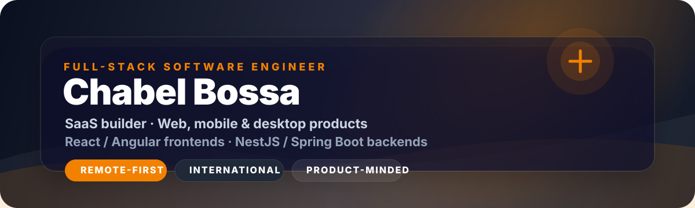

<p align="center">
  
</p>

<p align="center">
  <a href="https://www.chester-dev.com/"></a>
  <a href="mailto:chabeldev@gmail.com"></a>
  <a href="https://www.linkedin.com/in/chabel-holdo-bossa"></a>
  
</p>

---

## The Short Version

I am **Chabel Holdo Bossa**, a remote-first **Full-Stack Software Engineer** from Benin building production-grade software across **web, mobile, desktop, and SaaS platforms**.

My edge is simple: I do not just write screens and endpoints. I connect product thinking, clean architecture, user experience, and delivery discipline until the thing actually works in the real world.

> **Give me a messy product problem. I will turn it into flows, APIs, interfaces, and systems people can trust.**

<p align="center">
  
</p>

---

## Why People Should Pay Attention

<table>
  <tr>
    <td><strong>Product range</strong></td>
    <td>Web apps, SaaS platforms, mobile apps, desktop ERPs, dashboards, automation systems, and payment integrations.</td>
  </tr>
  <tr>
    <td><strong>Engineering range</strong></td>
    <td>Frontend, backend, APIs, databases, authentication, offline sync, CI/CD, cloud tooling, and technical architecture.</td>
  </tr>
  <tr>
    <td><strong>Current direction</strong></td>
    <td>Full-stack roles and remote opportunities where React, Angular, NestJS, Spring Boot, and product execution matter.</td>
  </tr>
  <tr>
    <td><strong>Signal</strong></td>
    <td>Smart Cities Hackathon FRIARE, Cotonou: 3rd Prize, April 2025, with RoadControl, an urban traffic analysis solution.</td>
  </tr>
</table>

---

## What I Can Own End-to-End

| Area | What I ship | Tools I use |
|---|---|---|
| **Product Frontends** | SaaS dashboards, admin panels, onboarding flows, responsive product UIs, PWAs | React, Next.js, Angular, TypeScript, Tailwind CSS |
| **Backends & APIs** | REST APIs, auth, business logic, payment workflows, messaging systems, integrations | Node.js, NestJS, Express.js, Fastify, Java, Spring Boot, Spring Security |
| **Data & Persistence** | Relational schemas, document models, local storage, offline-ready flows | PostgreSQL, MongoDB, MySQL, SQLite, JPA/Hibernate |
| **Mobile & Desktop** | Cross-platform mobile apps, desktop ERPs, offline-first experiences | React Native, Expo, Electron.js, Kotlin, Swift |
| **Delivery & Tooling** | Git workflows, containers, CI/CD, Firebase/Supabase integrations, deployment pipelines | Git, GitHub, Docker, CI/CD, Firebase, Supabase |

---

## Selected Work That Shows the Range

| Project | What I built | Why it matters |
|---|---|---|
| **Locapay** | Real estate management SaaS built and maintained with Next.js and NestJS | Business platform with real users, mobile PWA optimization, and production constraints |
| **PharmaOps** | Desktop pharmacy ERP with Electron.js and React | Stock management with FEFO logic, billing workflows, and offline data synchronization |
| **WaChap** | WhatsApp marketing automation SaaS integrated with Shopify and GoHighLevel | Automation architecture designed for high message volumes and commercial workflows |
| **YesCars** | Fleet management platform with web admin and mobile experience | End-to-end product design for operational vehicle management |
| **PayForBet** | Local payment integrations with KkiaPay and Feexpay | Payment infrastructure inside web architectures for local market realities |
| **RoadControl** | Smart Cities hackathon project for urban traffic analysis | Award-winning teamwork, applied problem solving, and civic-tech execution |

Most of my serious work is private because it belongs to clients, startups, or active products. The public GitHub is the surface. The shipped systems are the proof.

---

## My Engineering Operating System

```txt
1. Clarify the product goal before touching the code.
2. Design the smallest architecture that can survive real usage.
3. Build interfaces that feel obvious, fast, and trustworthy.
4. Keep APIs predictable, documented, and easy to extend.
5. Optimize for delivery without sacrificing maintainability.
6. Communicate clearly, especially when the problem is still blurry.
```

I like software that feels calm on the outside and disciplined on the inside: clean UX, readable code, strong data flow, and architecture that does not collapse when the product grows.

---

## Current Stack Focus

<p align="center">
  
  
  
  
</p>

```ts
const chabel = {
  role: "Full-Stack Software Engineer",
  location: "Benin, building internationally",
  mode: "remote-first",
  frontend: ["React", "Next.js", "Angular", "TypeScript", "Tailwind CSS"],
  backend: ["Node.js", "NestJS", "Java", "Spring Boot", "Spring Security", "REST APIs"],
  mobileAndDesktop: ["React Native", "Expo", "Electron.js", "Kotlin", "Swift"],
  databases: ["PostgreSQL", "MongoDB", "MySQL", "SQLite"],
  loves: ["SaaS", "clean UX", "reliable architecture", "shipping fast", "learning hard"],
};
```

---

## GitHub Pulse

<p align="center">
  
  
</p>

<p align="center">
  
</p>

---

## If You Are Hiring, Start Here

I am a strong fit for teams that need someone who can move across the stack and still care deeply about the product.

- You need a **frontend engineer** who understands APIs and product constraints.
- You need a **backend engineer** who can design practical services and integrations.
- You need a **full-stack builder** who can turn ambiguity into a shipped product.
- You need someone comfortable with **remote collaboration**, ownership, and fast learning.

The best conversations to have with me:

- Building SaaS products from zero to usable.
- Creating polished React, Next.js, or Angular interfaces.
- Designing NestJS or Spring Boot APIs.
- Making mobile, desktop, and offline-first workflows feel reliable.
- Turning a rough idea into a real product plan.

---

## Connect

If the work above matches what you are building, the fastest path is simple:

| What you need | Best place to go |
|---|---|
| **Start a conversation** | [Email me directly](mailto:chabeldev@gmail.com) |
| **See my work and positioning** | [Visit chester-dev.com](https://www.chester-dev.com/) |
| **Connect professionally** | [Find me on LinkedIn](https://www.linkedin.com/in/chabel-holdo-bossa) |

<p align="center">
  <a href="mailto:chabeldev@gmail.com"></a>
  <a href="https://www.chester-dev.com/"></a>
  <a href="https://www.linkedin.com/in/chabel-holdo-bossa"></a>
</p>

<p align="center">
  
</p>
